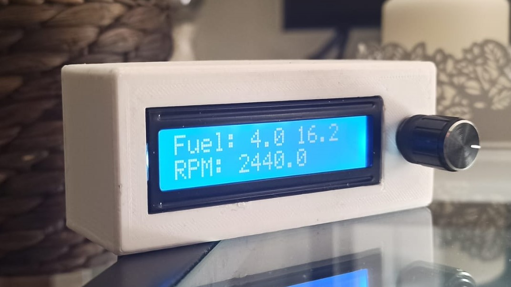
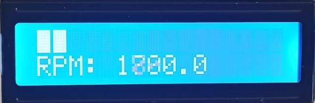
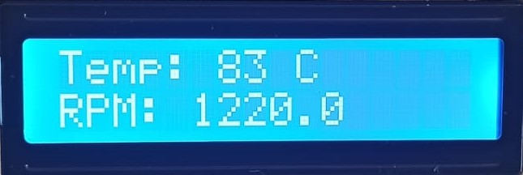
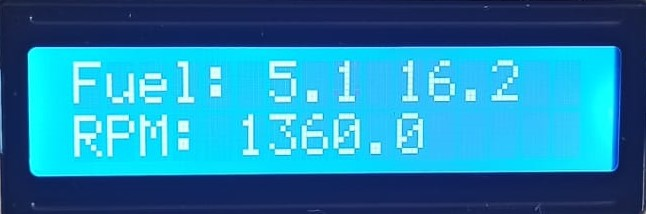
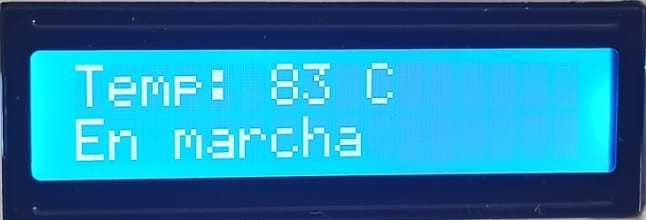
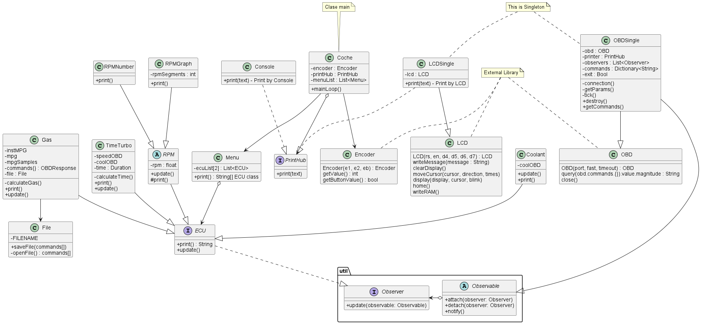

# Head-Up display
Head-Up display based on OBDII for RPi zero W actually compatible with LCD screen 1602A and a rotary encoder.


### Motivations
My Smart ForTwo only have a revcounter if you pay it as an extra, mine didn't come with that extra and I don't want to pay it, so I decided to create one myself taking advantage of the 
OBD-II protocol.

The initial idea was to only get the rpm of the car, but as you will see, I implemented much more things.
 
### What? How does it work

All the program is written in Python3 and relies on the PYTHON-OBD library which extracts de data from the car.

### Functions
The software can show:
- Engine RPM.


- Coolant Temperature.


- Gasoline consumption in L/100km (based in MAF sensor).


- Stop time to let the turbo cooldown.


### Dependencies
In order to make RPMGauge, it needs PYTHON-OBD, a rotary-encoder library and my LCDLibrary; these last two are already 
implemented in the project. 
In my car, the release version of PYTHON-OBD doesn't work, so download the zip of the main branch and install it via:
```Shell
$ pip install .
```
or you can also try:
```Shell
$ pip3 install .
```

### Installation
1. Download the zip
2. Edit constants.py to assign bluetooth obd ports and savefile root for the MPG.
3. Edit main.py to edit the pins of the LCD and the rotary.
4. Execute main.py
```Shell
$ python3 main.py
```

### Basic Usage


The basic usage relies on the object Menu and ECU commands,
every Menu actually handles a maximum of 2 ECU commands. 
For example, to create a menu which displays the RPM in number and the 
gasoline consumption will be created this way:
```Code
Menu(RPMNumber(), Gas())
```
After created a Menu we now can create an object Car(),
in this object we will specify the encoder object, the printer to use and a list of menus.
It also contains the mainLoop and other features like consider a diesel car.
Another basic example:
```Code
encoder = Encoder(13, 19, 6)
lcd = LCDHandler(d4=26, d5=19, d6=13, d7=6, en=5, rs=0)
main = Car(encoder, lcd, [menu1, menu2, menu3, menu4])
main.dieselCar()  # Consider a diesel car
main.mainLoop()
```
You can take advantage of the already programmed main.py

### Actual commands
```Code
Coolant()
DtcScreen()
RPMNumber()
RPMGraph()
Gas()
TimeTurbo()
```

## Información Adicional

### Librerías

#### LCD Library
Library for the controller **ST7066U** made by myself. Much faster than Adafruit one.

#### Rotary encoder Library
Le he realizado unos cambios para que funcione con el rotary conectado de GPIO -> GND, 
he añadido la función de un botón para los rotary con botón y lo he tratado como variable global.


#### Modelos 3D
Modelos 3D en formato stl de la caja en carpeta **doc/Modelos**

#### Conexiones:
Cableados a la RPi en carpeta **doc/Images**

### Productos:
- [Librería OBD original](https://github.com/brendan-w/python-OBD) 
- [Librería Rotary encoder original](https://github.com/nstansby/rpi-rotary-encoder-python)
- [Librería original LCD Adafruit](https://github.com/adafruit/Adafruit_Python_CharLCD)
- [Pantalla](https://es.aliexpress.com/item/32397063365.html?spm=a2g0o.productlist.0.0.779a3a31I4vpfB&algo_pvid=adf133c7-1ed9-4de1-b14b-2ab022e3496c&algo_exp_id=adf133c7-1ed9-4de1-b14b-2ab022e3496c-3&pdp_ext_f=%7B%22sku_id%22%3A%2212000026861398048%22%7D&pdp_pi=-1%3B1.9%3B-1%3B-1%40salePrice%3BEUR%3Bsearch-mainSearch): LCD 1602
- [Obd](https://es.aliexpress.com/item/4000809053108.html?spm=a2g0o.productlist.0.0.70e571ackddOMQ&algo_pvid=ea560480-3cf9-416e-9c37-55a7fe459be6&algo_exp_id=ea560480-3cf9-416e-9c37-55a7fe459be6-1&pdp_ext_f=%7B%22sku_id%22%3A%2212000025091114231%22%7D&pdp_pi=-1%3B4.22%3B-1%3B-1%40salePrice%3BEUR%3Bsearch-mainSearch): elm327
- [Rotativo](https://es.aliexpress.com/item/4000028678187.html?gatewayAdapt=glo2esp&spm=a2g0o.9042311.0.0.274263c0LgHA3h)

### Enlaces de interés OBD:
Para programarlo todo, he utilizado un OBD-II virtual el cual te ahorra bastante tiempo, ya que no necesitas bajar directamente al coche.
- [OBD VIRTUAL](https://github.com/Ircama/ELM327-emulator)

OBD II Codes.
- [OBD PIDs](https://en.wikipedia.org/wiki/OBD-II_PIDs)

### Raspberry AP:
Este programa permite utilizar la Raspberry como punto de anclaje Wi-Fi y de esta manera poder meter actualizaciones 
sin necesidad de sacar la Rpi de la caja.
- [raspberry](https://www.raspberrypi.com/documentation/computers/configuration.html#setting-up-a-routed-wireless-access-point)

### TO DO: